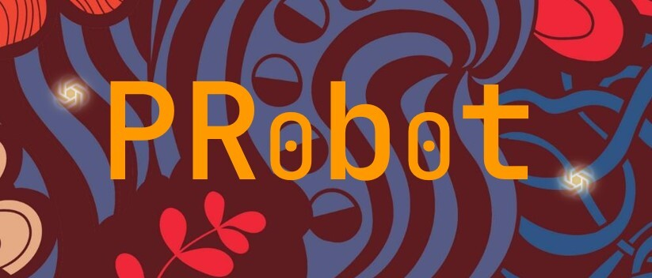

# Probot
## Project Title
Pr0b0t Git Pull Request Automation with GPT-3.5 API

## Description
PR0B0T is a new open-source platform designed to automate the process of injecting pull requests. By using cutting-edge technology and an advanced Git API, PR0B0T streamlines the process of generating and injecting pull request messages, saving users valuable time and effort.

With PR0B0T, you no longer need to spend hours writing pull request messages. The platform uses GPT-3.5 API and OpenAI to generate custom messages based on the specific pull request and repository, ensuring that each message is tailored to the needs of the user. Whether you're a developer, a project manager, or a team leader, PR0B0T makes it easy to inject pull request messages quickly and efficiently, allowing you to focus on what really matters – developing and improving your code.

## Key Features
- Automated pull request message generation using GPT-3.5 API, saving valuable time and effort.
- Cutting-edge technology implemented with Python and Git API.
- User-friendly console application that makes the process simple and efficient.

## Motivation
Managing pull requests is a time-consuming task that can be a major bottleneck in the software development process. It's easy to get bogged down in the details of writing pull request messages, which can slow down the entire project and make it difficult to stay on track. With PR0B0T, we aim to solve this problem and streamline the pull request process.

By automating the generation and injection of pull request messages, PR0B0T frees up developers' time, allowing them to focus on what they do best – writing great code. The platform's advanced technology ensures that each message is tailored to the specific needs of the user, saving them valuable time and effort. With PR0B0T, developers can spend less time on administrative tasks and more time on the work that matters most.

## Architecture
Server: 
- GitHubHandler - Github.py 
- OpenAI, prompt generation - OpenAI.py

Client, UI: 
- console python UI: UI.py

Insert a brief description of the project architecture here.

## Getting Started
Insert instructions on how to get started with the project here, including any pre-requirements.

## Usage
Insert instructions on how to use the project here.

## Team Members & github links:

### 
[Github Profile](https://github.com/dorbivas) 
Dor Bivas

### 
[Github Profile](https://github.com/danninon) 
Dan Inon 

